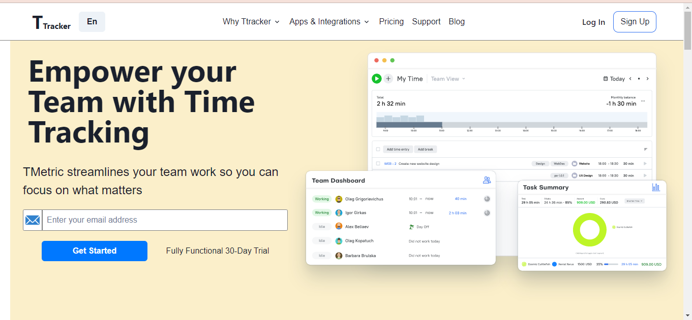

### Description:-
It is a team project built in 5 days with the effort of 5 people . __Time Tracker__ is a clone of [Tmetric](https://tmetric.com/). This website help you to save your precious time and improve your effeciency and you can also keep an eye on your performance that how much did you worked on each task.
This project is build on **MERN** (Mongodb , Express , React , NodeJS):-

### Deployed Link [Time Tracker](https://frontend-omgupta12.vercel.app/)

### Team Details:-
1.[Anshul Singla](https://anshul-singla.github.io/) (as Team Lead)

2.[Ravi Roshan](https://ravi98351.github.io/ravi_roshan.github.io/) (as team member)

3.[Anirban Sharma](https://anirbansharma1996.github.io/) (as team member)

4.[Abhjeet Kumar](https://abhizeit.github.io/) (as team member)

5.[Om Prakash Gupta](https://omgupta12.github.io/) (as team member)

#### External Packages used to build this project:-
-   Node Package Manager  
-    Chakra UI 
-    Postman 

**functionality in the project is:-**
- Responsive & Modern Navbar. 
- Login & Signup feature.
- Json Web Token feature so that you don't hav loging up again and again. 
- Pricing features.
- Sidebar to keep track of page you are using.
- Add & edit as many projects as you want.
- Breakdown bigger projects in simpler and acheiveable tasks.
- Tracker's page help you you to keep track of your time spend on each task or project.
- Role based access so that admin can have the control over multiple users.
- Use of Redux and redux thunk for state managment.
 
**Some images of clone**
- Landing Page & Navbar both normal and responsive

- Pricing Page

- Login & Signup

 

- Time Trackers Page

- Projects Page & Form

- Tasks Page & form

- Admin Panel with Toast notification feature

